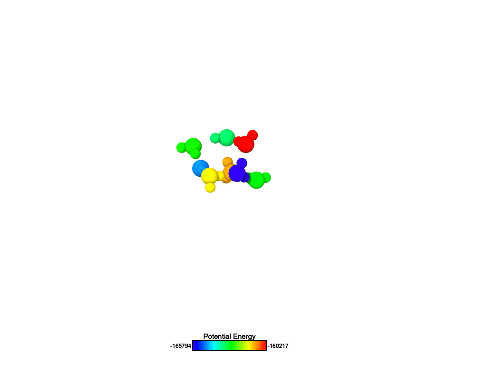

# EB-AVBMC for Water using Vashishta potential 
an extended AVBMC code to calculate free-energy of water using an all-atom Vashishta potential. 

Initial code is based on the work of [Loeffler et al.](https://github.com/mrnucleation/NucleationSimulationMC). We added the Vashishta potential, modified the acceptance rule, and added the ability to update the topology of the system if translation is accepted.  

<p align="center">
  
<p>

# Compilation 
To compile the code, 
```
mkdir objects
make
``` 

# Getting Started
You need a script file. Samples of how this scriptfiles looks like is given in the `example` folder.


