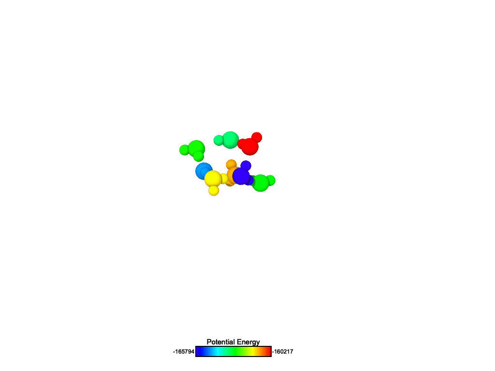

# EB-AVBMC for Water using Vashishta potential 
An extended AVBMC code to calculate free-energy of water using an all-atom Vashishta potential. 

This work is a part of the paper [**An Extended Energy-Biased Aggregation-Volume-Bias Monte Carlo (EB-AVBMC) Method for Nucleation Simulation of a Reactive Water Potential**](https://pubs.acs.org/doi/10.1021/acs.jctc.5c00722).

Initial code is based on the work of [Loeffler et al.](https://github.com/mrnucleation/NucleationSimulationMC). We added the Vashishta potential, modified the acceptance rule, and added the ability to update the topology of the system if translation is accepted.  

<p align="center">
  
<p>

# Compilation 
To compile the code, 
```
mkdir objects
make
``` 

# Getting Started
You need a script file. Samples of how this scriptfiles looks like is given in the `example` folder.


# Code Map
You can find the code map at the following Coggle link: [Code Map](https://coggle.it/diagram/ZDo1BgAjwnrfugDE/t/vashishta)
